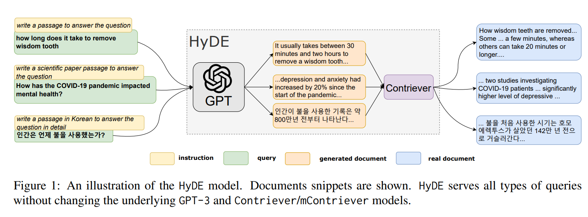

# Best Practices for RAG (Retrieval-Augmented Generation)

- RAG (Retrieval-Augmented Generation) has been extensively developed and validated as a core architecture for generative AI applications.
- While the concept of RAG is quite simple, achieving applications with usable accuracy levels involves many considerations, and many projects face challenges related to accuracy and development productivity.
- RAG has the following key components, each requiring appropriate consideration, design, and problem-solving.
- This document provides practical design and knowledge.

## Consideration of Overall Strategy

1. **Review of Expected Questions and Desired Answer Combinations**

   - First, review the potential combinations of expected questions and the desired answers. Regardless of the RAG architecture adopted, the ultimate goal is to ensure that users can retrieve or generate the information they need. Therefore, the first step is to clearly define this goal.
     - These question-answer combinations will also be used to evaluate the RAG architecture.
     - In some cases, they may be directly used as evaluation data, while in other cases, they might serve as input for creating detailed evaluation data.
     - For specific methods, please refer to the [RAG Evaluation Design](#rag-evaluation-design) section.

2. **Review of Datasets**

   - Next, consider the datasets that will be used to provide the information needed to meet user requirements. This may include not only internal data but also public information available through internet searches. The selection should not be data-driven but instead focused on choosing data that can resolve the expected questions.
     - For example, if the goal is to obtain a troubleshooting guide for laptops, relevant data might include previous support tickets, FAQs, procedural documents, and product specifications.
     - Similarly, in a research context, if the goal is to obtain an overview or key points of a topic, relevant data might include academic papers or conference proceedings.

3. **Review of Architecture**

   - Consider how to structure the RAG architecture to resolve the question-answer combinations based on the available datasets. For detailed design and implementation of each component, please refer to the subsequent chapters.

## Data Preprocessing
Tips for data preprocessing to create a search index for RAG

### Extracting Text Data from Documents

- **Text Data:** When text data can be directly obtained from documents, use that text data.
  - **PDF:** Many technical and official documents are often provided in PDF format. Use PyMuPDF or pdfminer.six to extract text.
  - **Word:** Business documents and reports are often saved in Word format. Use python-docx to extract text.
  - **HTML:** Use BeautifulSoup to extract text from web pages and online documents.
- **AI-OCR Required:** When documents are provided in formats such as images or PDFs where text data cannot be directly obtained, use AI-OCR (Optical Character Recognition) to extract text data.
  - **Azure:** Azure AI Document Intelligence can be utilized.

#### Document Analysis with Azure AI Document Intelligence
Azure AI Document Intelligence not only extracts text but also analyzes hierarchical document structures and detects figures. The details is [here](https://techcommunity.microsoft.com/t5/ai-azure-ai-services-blog/unlocking-advanced-document-insights-with-azure-ai-document/ba-p/4109675). It provides advanced machine learning-based document analysis APIs, and the Layout model offers comprehensive solutions for advanced content extraction and document structure analysis.

- **Hierarchical Document Structure Analysis:** Supports the retention of document context by splitting documents into sections and subsections in Markdown format. Enables chunking strategies that maintain context, such as semantic chunking.
- **Figure Detection:** Extracts key properties like boundingRegions, which detail the spatial positions of figures on the page. This allows for the extraction of figures and graphs, enabling a multimodal RAG architecture.

### Text Standardization and Normalization
If the original data is of low quality or if errors occur during OCR reading, perform data cleaning, standardization, and normalization. Possible methods include traditional rule-based (e.g., regular expressions) and LLM-based approaches. Specific processes include:

- **Removal of Unnecessary and Duplicate Information:**
  - Eliminate noise, metadata, and duplicate paragraphs.
- **Correction of Errors and Mistakes:**
  - Fix character recognition errors, grammatical errors, and typos.
- **OCR Error Correction:**
  - Correct misrecognized characters and words.
- **Correction of Terminology and Expression Variations:**
  - Create a keyword list and perform normalization.

## Chunking Optimization
In RAG, consider dividing the original document into appropriate sizes (chunking) when inputting data into the search index, taking into account search efficiency and the processing performance of large language models. While recent large language models have significantly increased token input capacity, it is recommended to consider RAG and accurate chunking since accuracy may decrease as context length increases. [Reference article](https://arxiv.org/abs/2402.14848)

- **Determining Chunking Necessity:**
  - **Cases Requiring Chunking:**
    1. **Search in Large Datasets:** When retrieving related information from large datasets, dividing data into smaller chunks improves search accuracy and efficiency.
    2. **Processing Long Texts:** Large language models have limitations on the length of text they can process at once. Chunking long texts into manageable sizes allows models to generate appropriate responses consistently.
  - **Cases Not Requiring Chunking:**
    1. **When the Original Document Size is Not Large:** If the document is around a few thousand tokens, LLM can interpret the context sufficiently without chunking.
    2. **When Context is Already Divided by Units:** If the document is already divided into multiple units for specific purposes or context, or if it's a FAQ with questions and answers already paired, there’s no need to further divide it, which may reduce the amount of information or consistency.

### Chunking Considerations

#### When Document Boundaries are Clear
- **Clear Boundaries:** Create chunks based on clear boundaries such as chapters, sections, headers. This approach ensures that each chunk retains meaningful and contextually coherent segments of the document.
  - **Examples:**
    - **By Chapter:** Divide documents into chunks where each chunk corresponds to a chapter.
    - **By Geographical Unit:** For documents with geographic information, split by regions such as prefectures.
    - **By Organizational Unit:** For organizational reports, divide by different units or departments.

#### When Document Boundaries are Not Clear
When document boundaries are not clear and determining the correct split points is challenging, consider the following methods:

- **Chunk by page:**
  - This is a very simple method, but it chunks on a page-by-page basis.
  - However, accuracy may be affected because of the loss of context for sentences that span pages.

- **Overlapping Chunks:**
  - **Context Preservation:** Overlapping chunks can maintain context continuity, which is crucial for long texts where maintaining coherence is important.
  - **Implementation:** Create chunks with overlapping sections (e.g., 10-20% overlap). Adjust the overlap percentage based on the document’s nature to ensure context is preserved while maintaining information accuracy.
  - **Example:** For a research paper, the end of one chunk could overlap with the start of the next, ensuring that key transitions and arguments are not lost.

- **Fixed-Length Chunks:**
  - **Long Chunks (Thousands of Tokens):** Suitable for detailed contexts where comprehensive understanding is required.
    - **Examples:**
      - **Long Articles:** Articles or reports that require detailed comprehension.
      - **Research Papers:** Each section of a research paper can be a chunk.
      - **Book Chapters:** Individual chapters of books where continuity and detail are crucial.
  - **Short Chunks (Hundreds of Tokens):** Useful when users need to quickly find specific information.
    - **Examples:**
      - **FAQs:** Short and precise answers to frequently asked questions.
      - **Product Specifications:** Clear and concise information about product features.
      - **Short Blog Posts:** Quick and easy to read information segments.

#### Vector Search Considerations:

  - **Embedding and Distinguishing Documents:** When using vector search, ensure that the chunks are distinguishable by embedding them effectively.
  - **Embedding Model Features:** Consider the features and dimensions of the embedding model.
  - **Overlap and Chunk Size:** Balance the chunk size and overlap to enhance the searchability and distinguishability of embedded documents.

#### Advanced Methods
- **Semantic Chunking:**
  - **Contextual Breakpoints:** Use semantic chunking to divide text based on semantic similarities. Identify breakpoints where there are significant changes in similarity.
  - **Tools and Implementations:** Utilize tools such as LangChain’s semantic chunker for precise and context-aware chunking.
    - **Example:** Segment paragraphs or sections where the topic or context shifts significantly, ensuring each chunk remains contextually coherent.

#### Adding Metadata
**Include Chapter name and Document name in each Chunk:** To increase the discriminative elements, include the Chapter name and Document name in each Chunk. This will make it easier to find information related to specific Chapters or documents during searches.

#### Example Implementation and Tools
- **Tools for Chunking:**
  - **Azure AI Document Intelligence:** For advanced document analysis, including hierarchical structure and figure detection.
- **Evaluation:**
  - **LlamaIndex’s Response Evaluation Module:** Efficiently assess chunk sizes for performance and response time.
  - **Benchmarks:** Use benchmarks like MTEB and BEIR to evaluate the effectiveness of chunking strategies.
- **Practical Example:**
  - For a technical document, use Azure AI Document Intelligence to extract text, divide the document into chunks by section headings, apply semantic chunking where necessary, and evaluate the chunk sizes using LlamaIndex to ensure optimal performance and accuracy.

By following these detailed guidelines and utilizing the appropriate tools and methods, you can effectively chunk documents for RAG, maintaining high accuracy and efficiency in information retrieval and generation tasks.

#### Chunking Evaluation
Finding the optimal chunk size is challenging. Sample documents and evaluate multiple patterns. Evaluation metrics are detailed in the RAG evaluation design, and tools like LlamaIndex’s Response Evaluation module can efficiently assess performance and response time for various chunk sizes.

### Chunking in Azure

Currently, there are two main methods to implement chunking using Azure services and features.

#### Text Split Skill on Azure AI Search

The text split skill can divide text into chunks. (More details about Azure AI Search skills will be discussed later.) You can specify whether to split the text by sentences or by a specific length of pages. As of now, splitting by section/header information is not supported, offering only simple splitting methods.

#### Document Intelligence

By leveraging the hierarchical structure analysis capabilities of Document Intelligence, you can structure the original document in Markdown format and implement code to split the Markdown headers into chunks. These chunks can then be pushed to the search engine.

### Selection of Embedding Models
Text embeddings are numerical representations that capture the semantics or meaning of words, phrases, or entire documents. These embeddings are foundational for many NLP tasks, such as sentiment analysis and text classification.

#### Selection Criteria
When selecting an embedding model, consider the following criteria:

- **Data Format Compatibility:** Different models support various data formats (text, image, multimodal, etc.). Ensure the model is compatible with your data source.
- **Accuracy (Benchmarks):** Compare models using benchmarks relevant to your specific task to determine which model performs best.
- **Dimensionality:** Models offer embeddings with different dimensions. Higher-dimensional embeddings generally provide greater accuracy but come with increased computational costs.
- **Latency:** The response performance varies between models. Choose a model that meets your performance requirements.
- **Language Support:** Ensure the model supports the languages relevant to your application.
- **Cutoff:** Like LLMs, embedding models have a cutoff date for the training data they include. Be aware of this to ensure the model's knowledge is up-to-date.
- **Cost:** Models are typically charged based on the number of tokens processed. Prices vary between models, so consider your budget when selecting a model.

### Practical Considerations for Embedding Model Selection

1. **Task-Specific Benchmarks:**
   - Use relevant benchmarks like MTEB (Massive Text Embedding Benchmark) and BEIR (Benchmark for Evaluating Information Retrieval) to evaluate model performance across tasks like search, classification, and clustering.
   - MTEB covers 56 tasks, providing a comprehensive evaluation framework.
   - BEIR focuses on search tasks, offering insights into the model’s effectiveness in various search-related applications.

2. **Dimensionality and Performance Trade-offs:**
   - Higher dimensions can capture more semantic nuances but increase computational complexity.
   - Balance the need for accuracy with available computational resources and latency requirements.

3. **Latency and Scalability:**
   - Evaluate the model’s response time to ensure it meets the application's performance criteria, especially in real-time or high-throughput scenarios.

4. **Language and Multilingual Support:**
   - Choose models that support the necessary languages, especially for applications requiring multilingual capabilities.
   - Some models may offer superior performance for specific languages or regions.

5. **Cost Efficiency:**
   - Assess the cost-effectiveness of models, particularly in large-scale deployments.
   - Consider the cost per token and overall budget constraints.

By carefully considering these criteria, you can select an embedding model that optimally balances accuracy, performance, and cost for your specific NLP tasks and applications.

#### Embedding on Azure
- **Text:** Azure OpenAI offers several [embedding models](https://learn.microsoft.com/en-us/azure/ai-services/openai/concepts/models#embeddings), including `text-embedding-3-small` optimized for latency and storage, and `text-embedding-3-large` for higher accuracy. Embedding models such as Cohere are available in the Azure AI Model Catalog.
- **Multimodal:** Azure AI Vision provides [multimodal embedding models](https://learn.microsoft.com/en-us/azure/ai-services/computer-vision/concept-image-retrieval) for multimodal (text and image) applications.

## Index Design
Summary of best practices for index design.

### Index Units

#### Perspectives on Index Partitioning
The perspectives on how to partition an index include:

- **Service Constraints:** Considerations such as storage size and vector DB data volume.
- **Security Considerations:** Partitioning documents at the index level to enable access control.
- **Data Sources:** Different sources such as M365, Azure, or third-party storage.
- **Data Types:** Different types such as text and images.
- **Search Requirements:** Whether you want to search across all data and rank it, or rank by data source or data type.
- **Operational Aspects:** Timing of original document updates and lifecycle management.

#### Examples
- **Single Index:** Using a single index simplifies querying since only one query is needed. However, it complicates the index update design if the original documents have different update timings and lifecycles.
- **Multiple Indices:** Partitioning indices by source makes management simpler, but increases the number of queries and requires additional effort to re-rank data on the application side or have the LLM determine relevance.

### Field Definitions

#### Key Considerations for Field Design in Indexing
- **Retrievable and Searchable Fields:**
  - **Searchable:** Fields that you want to use for calculating the search score.
  - **Retrievable:** Fields that you want to retrieve in the search results.
- **Fields for Filtering:**
  - Examples include file name and page number.
  - Categories such as department names or product categories.
- **Metadata Fields:**
  - Decide whether to include fields like summaries or key phrases.
- **Fields for Embedding:**
  - Typically, fields where context is important (keywords alone may not be meaningful).
  - Reference: [Vector storage in Azure AI Search](https://learn.microsoft.com/en-us/azure/search/vector-store)
- **Analyzer:**
  - An analyzer is necessary for the search engine to interpret queries.
  - **Default Analyzer:** In Azure AI Search, the default is "Standard Lucene Analyzer."
  - **Choosing an Analyzer:**
    - **Language Support:** Choose an analyzer that supports the target languages. For multilingual applications, consider whether to use a language-agnostic analyzer or convert the search engine to handle a single language.
    - **Text Characteristics:** The choice varies depending on the text format (e.g., standard sentences, technical documents, code).
    - **Tokenization Method:** Tokenization rules differ by language.
    - **Advanced Features:** Select features based on requirements, such as entity recognition for URLs, emails, dates, and numbers.

#### Techniques to Enhance Accuracy
- **Incorporate Anticipated Questions into the Index:**
  - Add expected questions based on the document content to the index. This approach makes it easier to hit user queries. Unlike HyDE, which brings the query closer to the document content, this method brings the document closer to potential queries.

### Data Import Strategy

#### Import Methods
When importing data into a search index, it's essential to consider the method of importation. Search engines typically support two primary import methods:
- **PUSH Method:** Users import data into the search index using APIs or SDKs supported by the search engine.
- **PULL Method:** The search engine uses connectors or crawlers to import data from external data sources.

In Azure AI Search, both PUSH and PULL methods are available, and the choice between them depends on specific use cases:
- **PUSH Method:**
  - **Unsupported Data Sources:** Use this method for data sources that are not supported by indexers, with no restrictions on the type of data source.
  - **Frequent Updates:** Ideal for scenarios requiring frequent document updates and real-time reflection. There are no limitations on the frequency of execution. Changes can be pushed to the index as often as needed, making this method suitable for applications requiring low latency (e.g., syncing an index with product inventory changes).
  - **Security Control:** Provides complete control over security.

- **PULL Method (Using Indexers):**
  - **Supported Data Sources Only:** This method can only be used with data sources that indexers support.
  - **Low-Code Operations:** Suitable for those who want to manage data import operations with low code.
  - **Skillsets Utilization:** Allows the use of skillsets (e.g., splitting, embedding, keyword extraction, translation).

Reference: [Azure AI Search Data Import Methods](https://learn.microsoft.com/en-us/azure/search/search-what-is-data-import)

#### Update Strategy

- Since source documents may be updated, it's important to plan how the index will be refreshed.
- During development, it's common to delete and rebuild the index as you iterate on the index design.
- However, once the index is in production, deleting it becomes difficult. In such cases, consider using incremental indexing or parallel indexing.

##### Incremental Indexing: Using the PUSH Model with Azure AI Search

- When using the PUSH model via REST API/Azure SDK, the `mergeOrUpload` action is commonly employed. This action performs a merge if the document already exists or an upload if it is new, making it the most typical action for incremental updates.
- A unique document key assigned to each document is necessary during updates.
- To keep track of document changes, consider adding fields to the index such as file update dates or file paths.

##### Incremental Indexing: Using Azure AI Search Indexers

- If using an Azure AI Search indexer, and if change detection is supported by the data source, the indexer can detect underlying data changes. It processes only new or updated documents with each run, leaving unchanged content as is.
- For example, for indexed content generated from Azure Storage, change detection is performed automatically, as the indexer tracks the last update using timestamps embedded in Azure Storage objects and files.
  - Note, however, that deletion detection is not supported. You need to implement data deletion as described in the [deletion detection documentation](https://learn.microsoft.com/en-us/azure/search/search-howto-index-changed-deleted-blobs?tabs=portal).

##### Parallel Indexing

- Parallel indexing involves creating a new index separate from the production index for development and testing purposes.
- This approach allows you to safely develop and test without impacting the existing index.
- However, this method temporarily creates multiple indexes, which may increase costs.
- In Azure AI Search, using an [index alias](https://learn.microsoft.com/en-us/azure/search/search-how-to-alias?tabs=rest) is recommended to swap in the new index without requiring changes to application code.

#### Skillsets (AI Enrichment)
Azure AI Search integrates with Azure AI services through **AI Enrichment** to process content that cannot be searched in its raw form. This is particularly useful for unstructured text, image content, or content requiring language detection and translation.

##### Built-in Skillset
- **Translation and Language Detection:** For multilingual searches.
- **Entity Recognition:** Extracts entities such as usernames, locations, and other significant terms from large text chunks.
- **Key Phrase Extraction:** Identifies and outputs key terms.
- **Optical Character Recognition (OCR):** Recognizes printed and handwritten text in binary files.
- **Image Analysis:** Describes the content of images and outputs descriptions as searchable text fields.

Use Cases: [Built-in Skills](https://learn.microsoft.com/en-us/azure/search/cognitive-search-concept-intro#use-cases-for-built-in-skills)

##### Custom Skillset
Custom skills can be created to address specific requirements not covered by built-in skills.

Use Cases: [Custom Skills](https://learn.microsoft.com/en-us/azure/search/cognitive-search-concept-intro#use-cases-for-custom-skills)

By carefully selecting the appropriate data import method and utilizing Azure AI Search's enrichment capabilities, you can ensure efficient and effective indexing, leading to improved search performance and relevance.

## Query Design

### Search Methods
Search engines and databases offer several major search methods. Choosing the appropriate method depends on the use case and data source. Here are the primary search methods:

1. **Keyword Search:**
   - **Description:** Returns search results based on keywords entered in the search query. It matches the input words with those in the documents.
   - **Use Cases:**
     - **Information Retrieval:** Searching news articles or blog posts.
     - **Product Search:** Finding products on an online shopping site.
     - **Basic Information Retrieval:** Searching dictionaries or encyclopedias.

2. **Full-Text Search:**
   - **Description:** Searches the entire document, considering keywords, phrases, and partial matches. It uses indexing for faster retrieval.
   - **Use Cases:**
     - **Document Management Systems:** Searching contracts or technical documents.
     - **Legal Databases:** Searching laws and case law.
     - **Academic Papers:** Detailed matching of content through full-text search.

3. **Vector Search:**
   - **Description:** Converts documents and queries into numerical vectors and calculates the similarity between these vectors to perform the search. It primarily relies on natural language processing (NLP) techniques.
   - **Use Cases:**
     - **Similar Document Search:** Finding similar academic papers or news articles.
     - **Recommendation Systems:** Recommending content based on user preferences.
     - **Question Answering Systems:** Finding the most appropriate answers to questions.

4. **Graph Search:**
   - **Description:** Represents data as a graph structure with nodes and edges, performing searches based on the relationships between nodes. It is particularly effective for highly connected data.
   - **Use Cases:**
     - **Social Network Analysis:** Detecting relationships and communities among users.
     - **Recommendation Engines:** Recommending items based on user-item relationships.
     - **Knowledge Graphs:** Enterprise search and corporate knowledge databases.

### Search Methods in Azure AI Search
Azure AI Search supports several basic search methods:
- **Full-Text Search:** 
  - **Benefits:** Can find conceptually similar information even when there are no exact keyword matches in the inverted index.
  - **Reference:** [Azure Full-Text Search](https://learn.microsoft.com/en-us/azure/search/search-lucene-query-architecture)
- **Vector Search:**
  - **Benefits:** Improves accuracy and initial result quality by applying semantic ranking. In some scenarios, such as queries with product codes, specialized terminology, dates, and names, keyword search may perform better due to its ability to identify exact matches.
  - **Reference:** [Azure Vector Search](https://learn.microsoft.com/en-us/azure/search/vector-search-overview)

### Advanced Search Methods in Azure AI Search
Azure AI Search incorporates [advanced search methods](https://techcommunity.microsoft.com/t5/azure-ai-services-blog/azure-cognitive-search-outperforming-vector-search-with-hybrid/ba-p/3929167) to build more accurate search solutions:

- **Hybrid Search:**
  - **Description:** Combines multiple search methods, such as full-text search and vector search, to enhance search accuracy by leveraging different characteristics of each method.
  - **Implementation Considerations:**
    - **Parameter Settings:** TBD – Guidelines for setting parameters.
    - **Threshold Adjustment:** TBD – Include new features of AI Search for threshold adjustments.
  
- **Semantic Ranker:**
  - **Description:** Uses Microsoft’s language understanding models to rerank search results, enhancing relevance and providing results more aligned with the user’s context.
  - **Implementation Considerations:**
    - **Parameter Settings:** TBD – Guidelines for setting parameters.

#### Query Design
In RAG (Retrieval-Augmented Generation), transforming user queries into an appropriate format can significantly enhance search accuracy, rather than directly querying the search engine with the user's question.

##### Query Expansion
- **Enhancing Questions:** Use an LLM to refine the input query by adding relevant information.
  - **Concrete Details:** Transform abstract content into more specific details.
  - **Contextual Division:** Split the query if it contains multiple contextual questions.
- **Adding Multiple Queries:** Generate and include several related queries.
- **Evaluating Search Results:** Assess multiple search results to determine which is closest to the original question.
- **Generating Multiple Queries:** Create several queries and execute searches for each, which increases response time.

##### HyDE (Hypothetical Document Embeddings)
- **Generating Hypothetical Answers:** Have the LLM generate hypothetical answers, then vectorize and use these for the search.
- **Increased Response Time:** This method increases end-to-end response time since the LLM generates answers.
- **Limitations in Unknown Domains:** Generating answers for unknown domains can lead to inaccuracies, making this approach less recommended for such cases.

##### RAG Fusion
Generate multiple similar queries from the input query and integrate the search results from each.

[Reference Article](https://blog.langchain.dev/query-transformations/)

##### Iterative Retrieval-Generator RAG
- **Step-by-Step Inference:** Start with a single query and iteratively refine it, using previous inference results as inputs to progressively resolve the user's query.

##### Additional Design Considerations
- **Index-Oriented Query Design:** Design queries based on how data is indexed.
  - **Consistent Processing:** Ensure that the same processing steps are applied when adding data to the index and when forming queries.
  - **Matching Index Data Expressions:** Convert queries to match the expressions used in the indexed data.
    - **Example:** For manuals that use formal and official expressions, convert the query to a similar format. For chat logs that use colloquial language, convert the query accordingly.
    - **Example:** Translate casual user expressions into domain-specific terms for documents filled with technical jargon.
- **Handling Multiple Questions:** Split the user's query into multiple queries if it contains several questions to avoid biased ranking towards one of the questions.
  - **Implementation Methods:** Handle this at the application level, call functions multiple times, or use query expansion techniques.

- **Combining HyDE and Query Expansion:** These methods can be used together, generating questions or searches flexibly based on the purpose and nature of the query.
  - **Example:** When the LLM has some pre-existing knowledge, generate hypothetical answers and split the query if it contains multiple intents.

## RAG Evaluation Design

### Evaluation Scope

In RAG (Retrieval-Augmented Generation), it is crucial to evaluate each component individually rather than conducting an end-to-end evaluation.

- **Retrieval Evaluation (Evaluator for the Retriever)**: Assess whether the retrieved results contain the expected information.
  - It has been [reported](https://arxiv.org/pdf/2402.14848) that accuracy decreases as the number of documents passed as input increases. Additionally, accuracy tends to drop when the relevant information is positioned mid-prompt. Therefore, a key metric is whether the top-ranked documents contain the correct answers upon retrieval.
  
  - Moreover, since the search index is often updated in actual operations, it is important to consider implementing a Regression Test to ensure that index changes do not negatively impact other queries.
  
- **Generation Evaluation**: Assess whether the generated response based on the retrieved results is the optimal answer to the question.
  - There are two main perspectives for evaluation:
    - Performance and quality assessment
    - Risk and safety assessment
  - Metrics may include traditional machine learning metrics like F1 scores, as well as annotations on specific aspects of outputs generated by large language models (LLMs), assessing attributes such as relevance, coherence, and fluency.

### Creation of Evaluation Data

As discussed earlier, the first step in designing a RAG architecture is to consider the key combinations of anticipated questions and expected answers. The method described in this section can be used in the initial step and when creating comprehensive and detailed evaluation data.

1. **Create Questions**

- Prepare various types of questions, considering anticipated user queries and multiple patterns that span different documents. Since users might not be experts in the relevant domain, consider a variety of questions, including easy and abstract ones.
  - Abstract questions that require multiple sentences for an answer
  - Shortened queries similar to those typically entered in search engines
  - Queries where the answer uses different words or phrases than the question
  - Queries with only one correct answer
  - Queries that ask multiple things
  - Queries in multi-turn conversations

2. **Generate Baseline Responses with LLM**

- This step is optional. Use an LLM to generate responses to the questions created in step 1.
- Ideally, a domain expert would create responses for each question, but due to resource constraints, this may not always be feasible.
- In such cases, an approach where the LLM generates responses can be taken. This allows for a quick baseline generation while reducing manual effort.
- However, these LLM-generated responses should not be used without appropriate supervision and careful review/enhancement/modification by human experts. Ensure that a proper review process is in place.

3. **Create Expert Responses**

- Domain experts create the ideal responses for each question.
- If LLM-generated responses were used in step 2, experts review and improve those responses here.
- Additionally, references to source documents should be added for retrieval evaluation.

#### Number of Evaluation Data

It is challenging to provide a universal guideline on how many evaluation data are sufficient. The number should be determined based on anticipated question patterns and key evaluation perspectives. 

If the number of questions is limited, a simple FAQ may suffice. However, in scenarios where RAG is employed, a broader range of question patterns is expected. Based on current experience, it is common to prepare at least several dozen evaluation data sets.

### Evaluation Metrics

#### Retrieval Result Evaluation

Assess whether the retrieved results contain the expected information. Metrics used in the retrieval system can be utilized for evaluation.

- **Metrics:**
  - **Precision@K:** Measures the proportion of relevant documents among the top K results. This is a crucial metric for evaluating retrieval accuracy.
  - **Mean Average Precision (MAP):** Calculates the average precision across all relevant documents in the retrieval results.
  - **Normalized Discounted Cumulative Gain (nDCG):** Evaluates the quality of ranking in the retrieval results.
  - **Regression Test:** Establishes a mechanism to evaluate the impact of index updates on other queries. This ensures that changes to the search index do not adversely affect query performance.

#### Generation Result Evaluation

Evaluate whether the responses generated based on the retrieval results are optimal answers to the questions. This evaluation covers the entire end-to-end RAG application (question → retrieval → generated answer), necessitating both quality and safety assessments.

##### Overview of Metrics

The table below summarizes the types of metrics used in RAG applications. While traditional metrics for measuring accuracy against ground truth may still be employed, RAG applications often involve free-form question answering where a single correct answer may not exist. Consequently, LLM-based evaluation is becoming more common.

Moreover, in generative AI applications, new risks (prompt attacks, hallucinations, misleading behavior due to more human-like outputs, etc.) are emerging, making safety a critical metric.

Comprehensive evaluation must integrate these factors.

| Metric Category               | Description                                                                                     | Use Case                                                    |
|-------------------------------|-------------------------------------------------------------------------------------------------|-------------------------------------------------------------|
| **Traditional ML Metrics**     | Quantifies the accuracy of generated output compared to expected answers                       | Used in classification and short-form question answering    |
| **AI-Assisted Metrics**        | Annotates attributes such as relevance, coherence, and safety of LLM-generated outputs         | Used in evaluating the quality of creative or free-form Q&A |
| **Risk and Safety Metrics**    | Evaluates AI system risks and safety based on simulated adversarial interactions or annotations | Used in vulnerability assessments and content risk annotations|

##### AI-Assisted Metrics Details

Generative quality metrics are used to evaluate the overall quality of content generated by generative AI applications. These metrics assess various attributes (groundedness, relevance, coherence, fluency, retrieval score, GPT similarity) through LLMs.

##### Example of Metrics

Below are examples of metrics. Define metrics as prompts, and have the LLM evaluate them by providing the ground truth and response data from the application as context.

To evaluate quantitatively, specify a score range, such as 1 being the lowest and 5 the highest. This allows for quantitative assessment of the quality, relevance, grammatical accuracy, and naturalness of AI-generated content.

| Metric Category               | Score Range | Description                                                                 | Use Case                                                    | Input                                       |
|-------------------------------|-------------|-----------------------------------------------------------------------------|-------------------------------------------------------------|---------------------------------------------|
| **Groundedness (AACS-based)**  | 1-5         | Measures the degree to which the model's response aligns with source data.  | Used for fact-checking in information retrieval or summarization | Question, context, generated response       |
| **Groundedness (Prompt-only)** | 1-5         | Measures the degree to which the model's response aligns with user-defined context. | Used for fact-checking when no source data is available   | Question, context, generated response       |
| **Relevance**                  | 1-5         | Measures the relevance of the model's response to the given question.       | Used for assessing the accuracy of question answering        | Question, context, generated response       |
| **Coherence**                  | 1-5         | Measures the naturalness and smoothness of the response.                    | Used for assessing the readability and usability of responses | Question, generated response                |
| **Fluency**                    | 1-5         | Measures the grammatical accuracy of the response.                          | Used for evaluating grammatical correctness                   | Question, generated response                |
| **Retrieval Score**            | 1-5         | Measures the relevance of retrieved documents to the question.              | Used for evaluating the quality of document retrieval         | Question, context, generated response       |
| **GPT Similarity**             | 1-5         | Measures the similarity between the ground truth and generated response.    | Used for assessing accuracy in text generation tasks          | Question, ground truth response, generated response |

##### Caution with AI-Assisted Metrics

While using LLMs is highly convenient for evaluating large datasets, it is not recommended to rely solely on LLMs for all evaluations. LLMs may occasionally produce incorrect results. Therefore, it is essential to incorporate a review of evaluation results by experts.

##### Evaluation Tools and Methods in Azure AI Studio

Azure AI Studio supports the [evaluation of generative AI applications](https://learn.microsoft.com/en-us/azure/ai-studio/concepts/evaluation-approach-gen-ai) through three pathways:

1. **Playground**: Manually observe and evaluate model grounding and responses.
2. **Flow**: Link prompts and tools, creating and evaluating workflows.
3. **Direct Dataset Evaluation**: Submit collected datasets directly to the evaluation wizard for automated assessment.

Azure AI Studio recommends starting with manual evaluation before proceeding to automated evaluation. Automated evaluation supports large-scale measurement of system quality and safety, facilitating continuous assessment. Additionally, using AI-assisted metrics allows for evaluation even in the absence of ground truth.

You can check the evaluation results from the Azure AI Studio dashboard. You can visualize the overall evaluation for multiple data sets, and you can also check the detailed results for each individual data set.

