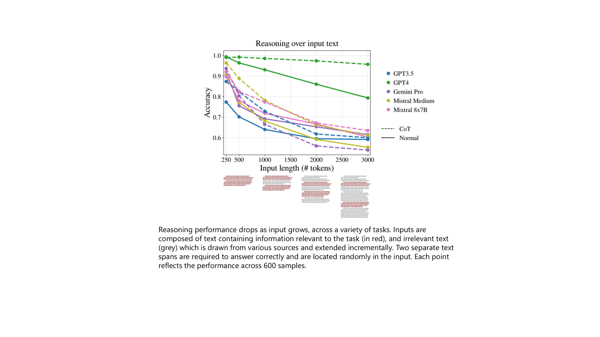
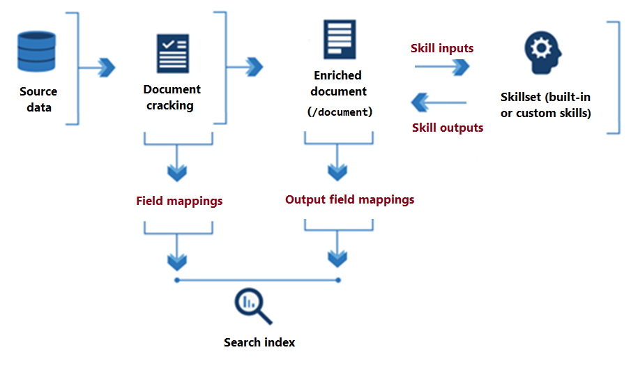
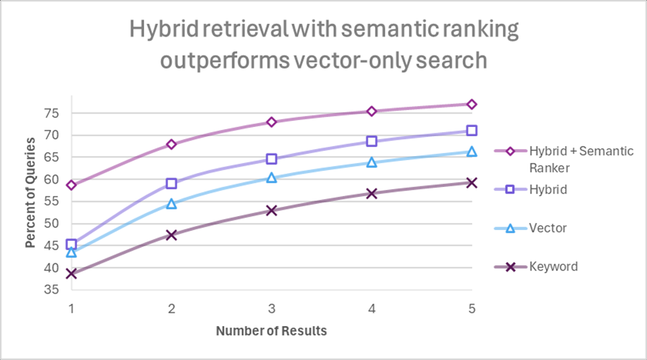
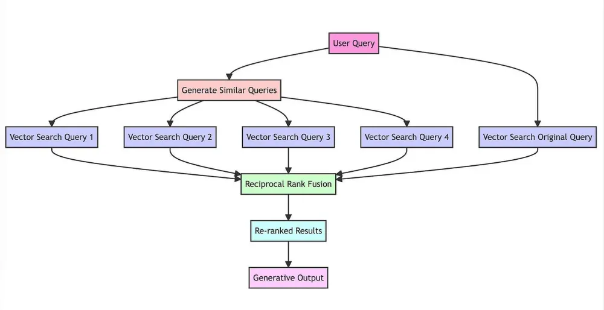
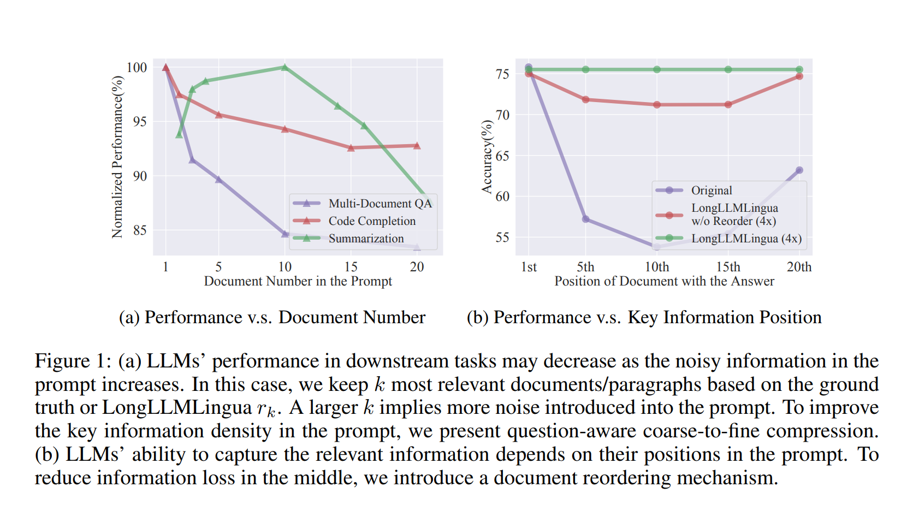

# Best Practices for RAG (Retrieval-Augmented Generation)

- RAGは、生成AIアプリケーションのコア・アーキテクチャとして広範囲に開発され、検証されてきました。
- RAGのコンセプトは非常にシンプルですが、使用可能な精度レベルのアプリケーションを実現するには多くの考慮事項があり、多くのプロジェクトが精度と開発生産性に関する課題に直面しています。
- RAGは、以下のような主要な構成要素を持っており、それぞれで適切な検討・デザイン・課題解決が必要になります。
- 本ドキュメントでは、実践的な設計と知識を提供します。

## データ前処理
RAGの検索インデックスを作成するためのデータ前処理の Tips

### ドキュメントからテキストデータを読み取る

- テキストデータ: ドキュメントから直接テキストデータを取得できる場合は、そのテキストデータを使用します。
  - PDF: 多くの技術文書や公式文書はPDF形式で提供されることが多い。PyMuPDFやpdfminer.sixを使用してテキストを抽出。
  - Word: ビジネス文書やレポートなどがWord形式で保存されていることが多い。python-docxを使用してテキストを抽出。
  - HTML: ウェブページやオンラインドキュメントからテキストを抽出する際に使用。BeautifulSoupを使用してテキストを抽出。
- AI-OCRが必要なパターン: ドキュメントが画像やPDFなどの形式で提供され、テキストデータを直接取得できない場合は、AI-OCR（Optical Character Recognition）を使用してテキストデータを抽出します。
  - Azure では、Azure AI Document Intelligence を利用できます。

#### Azure AI Document Intelligence でのドキュメント分析
Azure AI Document Intelligence は、単純なテキスト抽出だけでなく、階層的なドキュメント構造分析と図の検出を行ってくれます。詳細は[こちら](https://techcommunity.microsoft.com/t5/ai-azure-ai-services-blog/unlocking-advanced-document-insights-with-azure-ai-document/ba-p/4109675)。高度な機械学習ベースのドキュメント分析 API を提供しており、 Layout モデルにより、高度なコンテンツ抽出機能とドキュメント構造分析機能の包括的なソリューションが提供されます。

- 階層文書構造分析: ドキュメントを Markdown 形式でセクションとサブセクションを分割し、ドキュメントのコンテキストの保持をサポートしてくれます。セマンティックチャンキングなど、コンテキストを維持したチャンキング戦略を可能にします。
- 図の検出: ページ全体の図形の空間的な位置を詳細に表示する boundingRegions などの主要なプロパティを抽出します。これにより、図やグラフを抽出し、マルチモーダルな RAG アーキテクチャを実現することが可能になります。

### テキストの標準化・正規化
元のデータが低品質だったり、OCRで読み取った場合は読み取りミスが発生する可能性があるため、データのクリーニング、標準化・正規化を行います。実施方法としては、従来のルールベース（正規表現など）とLLMを用いる方法が候補となります。
具体的には、以下のような処理を行います。

- 不要情報、重複情報の削除
  - ノイズやメタデータ、重複する段落などを除去
- 誤り・ミスの修正
  - 字認識ミス、文法エラー、タイポの修正
- OCRの場合：読み取りミスの修正
  - 誤認識された文字や単語を修正
- 用語・表現の揺らぎの修正
  - キーワードリストの作成、名寄せ処理をする

### Chunking Optimization
RAG においては、検索の効率性、大規模言語モデルの処理性能を考慮して、検索インデックスにデータを投入する際に、元のドキュメントを適切なサイズに分割（チャンキング）する検討を行います。
最近リリースされた大規模言語モデルは、入力可能なトークン数が大幅に増えているため、わざわざ RAG をしたり、そのためにチャンキングをしたりする必要はないという声も上がっています。しかし、コンテキスト長が長くなるほど、LLMの精度が下がるという事象も報告されているため、RAG およびそれを精度高く実現するためのチャンキングを検討することが推奨されます。[Reference article](https://arxiv.org/abs/2402.14848)

ただし、チャンキングの実施有無および、適切なサイズを見極めるのは非常に難しいプロセスです。ここでは、判断基準のガイダンスを提供します。

#### チャンキング実施の判断基準
##### チャンキングが必要なケース
1. 大規模データセットの検索
大量のデータから関連情報を検索する際、データを小さなチャンクに分割すると、検索精度と効率が向上します。例えば、大規模な文献データベースやニュース記事アーカイブから特定の情報を引き出す場合です。

2. 長文テキストの処理
大規模言語モデル（LLM）は一度に処理できるテキストの長さに制限があります。長文テキストをチャンキングすることで、モデルが一貫して処理できるサイズに分割し、適切な応答を生成しやすくなります。例えば、長いレポートや小説のようなドキュメントを解析する場合です。

##### チャンキングが必要ないケース
1. 元のドキュメントのサイズが大きくない場合
数1000トークンくらいであれば、LLMで十分コンテキストを解釈することが可能なため、チャンキングを必ずしもする必要はありません。

2. コンテキストがすでに何らかの単位で分割されている場合
ドキュメント自体が目的やコンテキスト単位で複数に分割されていたり、FAQなどすでに質問と回答がセットになっている場合は、わざわざ分割して、情報量や一貫性を減らす必要はありません。

#### チャンキング検討

##### ドキュメントの区切りが明確な場合
- 章、節、ヘッダーなどの明確な区切りでChunkを作成します。
  - 例: ドキュメントの章ごとに分割、都道府県ごとに分割、組織単位で分割

##### ドキュメントの区切りが明確でない場合
ドキュメントの区切りが明確でなく、どこで切るのが正しいか判断するのが難しい場合、以下の方法を検討します。

- **ページでのChunk**
  - 非常にシンプルな方法だが、ページ単位でチャンク分割する。
  - ただし、ページをまたがるような文章のコンテキストを失ってしまうため、精度に影響が出る可能性がある。
- **Chunk を Overlapping**
  - 文章が長くて一貫性が重要な場合、オーバーラップさせて分割することで、コンテキストを保ちながら情報を分割
  - Chunk の前後を一定割合重複（ドキュメントの性質により割合調整：まずは10~20％程度）させてChunkを作成。これにより、コンテキストを維持しつつ情報の正確性を保つ。
- **固定長でのChunk**
  - 長いほう（数千）がいいパターンの具体例：長文の記事、研究論文、本の章など、詳細なコンテキストが重要な場合に適用。
    - 例: 学術論文の各セクション、技術ドキュメントの詳細な手順。
  - 短いほう（数百）がいいパターンの具体例：ユーザーが特定の情報をすばやく見つけたい場合、短いChunkが有効。
    - 例: FAQ、製品仕様、短いブログ記事。

##### ベクトル検索を採用する際

  - **ドキュメントの埋め込みと区別：** ベクトル検索を使用する場合、チャンクを効果的に埋め込むことで、チャンクが区別できるようにする。
  - **埋め込みモデルの特徴：** 埋め込みモデルの特徴と次元を考慮する。
  - **オーバーラップとチャンクサイズ：** チャンクサイズとオーバーラップのバランスをとり、埋め込み文書の検索性と識別性を高める。

#### メタデータ
- Chapter名、ドキュメント名を各Chunkに含む: 判別する要素を増やすため、各ChunkにChapter名やドキュメント名を含めます。これにより、検索時に特定のChapterやドキュメントに関連する情報をより簡単に見つけることができます。

#### Chunking Evaluation
チャンキングは一度で最適なサイズを見つけるのは困難です。ドキュメントをサンプリングして、何パターンか評価するのがよいでしょう。
評価指標は、[RAGの評価設計](#RAGの評価設計)で詳細に説明しますが、以下のリンクのような評価をします。
  - https://learn.microsoft.com/en-us/azure/ai-studio/concepts/evaluation-metrics-built-in?tabs=warning

評価を効率的に実施する方法として、 LlamaIndex の Response Evaluation module を使うと、複数の Chunk サイズのテスト（パフォーマンス、レスポンスタイム）を評価することが可能です。
  - https://www.llamaindex.ai/blog/evaluating-the-ideal-chunk-size-for-a-rag-system-using-llamaindex-6207e5d3fec5

#### Advanced Method
- Semantic Chunking: 文ごとにEmbeddingの類似性を取得して、類似度に差がある箇所をブレークポイントとすることで、意味を持ったチャンク分割を行う手法も存在する。
  - https://python.langchain.com/v0.1/docs/modules/data_connection/document_transformers/semantic-chunker/
  - https://python.langchain.com/v0.1/docs/modules/data_connection/document_transformers/semantic-chunker/

#### AzureでのChunking

現時点で、Azure のサービス・機能を活用して、Chunkingを実装する手段は大きく2つ存在します。

##### Text Split skill on Azure AI Search
テキスト分割スキルは、テキストをチャンクに分割することができます。（Azure AI Search のスキルについては後述）
テキストを文章に分割するか、特定の長さのページに分割するかを指定できます。現時点では、Section/Header情報での分割には対応しておらず、シンプルな分割方法のみが提供されています。

##### Document Intelligence
Document Intelligence の階層構造分析機能を使って、元のドキュメントをマークダウン形式で構造化し、マークダウンのヘッダーを分割するコードを実装してチャンクに分割します。分割したチャンクを検索エンジンにPUSHします。

### 埋め込みモデルの選択
テキスト埋め込みは、単語、フレーズ、または文書全体の意味を捉える数値表現です。これらの埋め込みは、感情分析やテキスト分類など、多くの自然言語処理（NLP）タスクの基盤となります。

#### 選択基準
埋め込みモデルを選択する際には、以下の基準を考慮します：

- **データ形式の互換性:** モデルごとにサポートするデータ形式（テキスト、画像、マルチモーダルなど）が異なるため、データソースに対応するモデルを選ぶことが重要です。
- **精度（ベンチマーク）:** 特定のタスクに関連するベンチマークを使用してモデルを比較し、最も性能の高いモデルを選択します。
- **次元数:** モデルは異なる次元数の埋め込みを提供します。高次元の埋め込みは一般的に精度が高いですが、計算コストも増加します。
- **レイテンシ:** モデル間で応答性能が異なるため、パフォーマンス要件を満たすモデルを選びます。
- **言語サポート:** アプリケーションに関連する言語をサポートしているモデルを選択します。
- **カットオフ:** LLM（大規模言語モデル）と同様に、埋め込みモデルにはトレーニングデータのカットオフ日が存在します。モデルの知識が最新であることを確認することが重要です。
- **コスト:** モデルは処理するトークンの数に基づいて料金が発生します。モデルごとに料金が異なるため、予算を考慮して選択します。

### 埋め込みモデル選択の実際の考慮事項

1. **タスク特有のベンチマーク:**
   - MTEB（Massive Text Embedding Benchmark）やBEIR（Benchmark for Evaluating Information Retrieval）など、関連するベンチマークを使用して、検索、分類、クラスタリングなどのタスクにおけるモデルの性能を評価します。
   - MTEBは56のタスクをカバーし、包括的な評価フレームワークを提供します。
   - BEIRは検索タスクに焦点を当て、モデルの検索関連アプリケーションにおける有効性に関する洞察を提供します。

2. **次元数と性能のトレードオフ:**
   - 高次元の埋め込みはより多くの意味的ニュアンスを捉えることができますが、計算の複雑さが増します。
   - 精度の必要性と利用可能な計算リソースおよびレイテンシ要件のバランスを取ります。

3. **レイテンシとスケーラビリティ:**
   - 特にリアルタイムや高スループットのシナリオにおいて、アプリケーションの性能基準を満たすためにモデルの応答時間を評価します。

4. **言語および多言語サポート:**
   - 必要な言語をサポートするモデルを選択します。特に多言語対応が必要なアプリケーションでは重要です。
   - 一部のモデルは特定の言語や地域において優れた性能を発揮することがあります。

5. **コスト効率:**
   - 特に大規模展開においてモデルのコスト効率を評価します。
   - トークンあたりのコストや全体の予算制約を考慮します。

これらの基準を慎重に考慮することで、特定のNLPタスクやアプリケーションに最適なバランスを持つ埋め込みモデルを選択することができます。

#### Azureでの埋め込み
- **テキスト:** Azure OpenAIは、レイテンシとストレージに最適化された`text-embedding-3-small`や、高い精度を提供する`text-embedding-3-large`など、いくつかの[埋め込みモデル](https://learn.microsoft.com/en-us/azure/ai-services/openai/concepts/models#embeddings)を提供しています。Cohereの埋め込みモデルもAzure AIモデルカタログで利用可能です。
- **マルチモーダル:** Azure AI Visionは、テキストと画像のマルチモーダルアプリケーション向けの[マルチモーダル埋め込みモデル](https://learn.microsoft.com/en-us/azure/ai-services/computer-vision/concept-image-retrieval)を提供しています。

## インデックス設計
インデックス設計についてまとめます。

### インデックスの単位
#### インデックス分割観点
インデックスの分割観点には以下のような観点があげられます。
- **サービスの制約:** ストレージサイズやベクターデータベースのデータ量を考慮。
- **セキュリティの考慮:** アクセス制御を可能にするため、インデックスレベルでの文書の分割。
- **データソース:** M365、Azure、サードパーティのストレージなど、異なるソース。
- **データタイプ:** テキストや画像などの異なる種類。
- **検索要件:** 全データを横断的に検索してランク付けするか、データソースやデータタイプごとにランク付けするか。
- **運用面:** 元の文書の更新タイミングとライフサイクル管理。

#### 具体例
- **シングルインデックス:** インデックスを１つにするとクエリは１回で済むので楽ですが、元のドキュメントの更新タイミング、ライフサイクルが異なる場合は、インデックスの更新の設計がやや煩雑になります。
- **マルチインデックス:** インデックスをソースごとに複数にわけると、各インデックスの管理はシンプルになりますが、クエリの回数が増えるのと、取得したデータをアプリ側でリランキングしたり、LLMにどれが関連性が高いかを判断させたりする手間が増えます。

### フィールド定義
インデックスに持たせるフィールド設計の観点をあげます。
- Retrievable、Searchable にすべき項目
  - Searchable：検索スコアの計算に使いたい項目
  - Retrievable：検索結果として利用したい項目
- フィルタとして持たせるべき項目
  - ファイル名やページ番号など
  - カテゴリ（部署名、商品カテゴリなど）
- メタデータとして持たせるべき項目
  - 要約やキーフレーズなどを含めるかどうかを決定。
- Embedding対象の項目
  - 基本的にはコンテキストが重要になる項目（キーワードのみだとあまり意味がない）
  - https://learn.microsoft.com/en-us/azure/search/vector-store
- Analyzer
  - クエリを検索エンジンが解釈するために、Analyzer が必要になる。
    - Azure AI Search では、デフォルトは「Standard Lucene Analyzer」
  - Analyzer は何を選択するべきか？
    - 言語サポート: 対象となる言語に対応したAnalyzerを選択します。マルチ言語のアプリケーションの場合は、言語に依存しない Analyzer を利用するか、それとも検索エンジン側をすべて単独の言語に変換して扱うかを選択するなどが考えられます。
    - テキストの特性: テキストがどのような形式であるか（例：標準的な文章、技術文書、コードなど）によっても選択が変わります。
    - トークン化の方式: 言語によって、トークン化する際の区切り文字が変わります。
    - 高度な機能: エンティティの認識 (URL、メール、日付、数字) などの高度な機能を要件に応じて選定します。
- 精度を高めるためのテクニック
  - ドキュメントの内容から想定される質問文をインデックスに追加しておく。（ユーザの質問をヒットさせやすくする狙い。HyDEはクエリをドキュメントの内容に近づけるアプローチだが、こちらはドキュメント側を質問に近づけるアプローチ）

### データインポート戦略
#### インポート方式
検索インデックスに対して、データをインポートする方式を検討する必要がある。検索エンジンが
- PUSH型：検索エンジンがサポートしている、APIやSDKを使って、ユーザがデータを検索インデックスにインポートする
- PULL型：検索エンジンがサポートしている外部データソースへのコネクターやクローラーを使ってデータをインポートする。

Azure AI Search では、2種類のデータインポート方法が用意されている。どのような使い分けをするべきか？
  https://learn.microsoft.com/en-us/azure/search/search-what-is-data-import
- PUSH型
  - インデクサーが対応していないデータソース（データソースの種類に制限はない）
  - 頻繁なドキュメント更新、リアルタイムな反映が必要なケース。実行頻度に制限はありません。変更は何度でもインデックスにプッシュできます。待機時間が短い要件を持つアプリケーション (たとえば、インデックスを製品在庫の変動と同期させる必要がある場合) では、プッシュ モデルが唯一のオプションです。
  - セキュリティのコントロール（完全に制御可能）
- PULL型（インデクサーを使用する）
  - インデクサーが対応しているデータソースのみ
  - データインポート運用をローコードで実現したい
  - スキルセット（スプリット、Embedding、キーワード抽出、翻訳など）を使いたい

#### 更新タイミング：TBD
- ファイルの更新日をもってどのように更新していくのがよいか？
  - どの行が更新対象になるかを判断するのが難しい。
    - 同じドキュメント、タイトル、更新日

#### スキルセット（AI Enrichment）
Azure AI Search には、生の形式で検索できないコンテンツを処理するために Azure AI サービスと統合する"AI エンリッチメント" という機能があります。
生のコンテンツが、非構造化テキスト、画像コンテンツ、または言語検出と翻訳を必要とするコンテンツの場合は、エンリッチメントが有用です。

##### Built-in Skillset
- 多言語検索の場合の翻訳と言語検出
- テキストの大きなチャンクからユーザー名、場所、その他のエンティティを抽出するエンティティ認識
- 重要な用語を識別して出力するキー フレーズ抽出
- バイナリ ファイル内の印刷されたテキストと手書きのテキストを認識する光学式文字認識 (OCR)
- 画像の内容を説明し、説明を検索可能なテキスト フィールドとして出力する画像分析

[ユースケース](https://learn.microsoft.com/en-us/azure/search/cognitive-search-concept-intro#use-cases-for-built-in-skills)

##### Custom Skillset
[ユースケース](https://learn.microsoft.com/en-us/azure/search/cognitive-search-concept-intro#use-cases-for-custom-skills)

## クエリ設計
### 検索手法
検索エンジンやデータベースは以下のようなメジャーな検索手法があり、用途やデータソースに応じて、適切な検索手法を選択する必要があります。

1. キーワード検索：
- 解説：検索クエリとして入力されたキーワードに基づいて検索結果を返します。入力された単語が文書内に含まれているかどうかを照合します。
- ユースケース・使いどころ：
  - 情報検索：ニュース記事やブログの検索。
  - 製品検索：オンラインショッピングサイトでの製品検索。
  - 基本的な情報取得：辞書や百科事典の検索。

2. フルテキスト検索：
- 解説：文書全体を対象にし、キーワードだけでなく、フレーズや部分一致などを考慮して検索します。インデックスを使用して高速化されています。
- ユースケース・使いどころ：
  - ドキュメント管理システム：契約書や技術文書の検索。
  - 法律データベース：法令や判例の検索。
  - 学術論文の検索：全文検索により詳細な内容のマッチングが可能。

3. ベクトル検索：
- 解説：文書やクエリを数値ベクトルに変換し、これらのベクトル間の類似度を計算することで検索を行います。主に自然言語処理（NLP）に基づく手法です。
- ユースケース・使いどころ：
  - 類似文書検索：学術論文やニュース記事の類似文書検索。
  - レコメンデーションシステム：ユーザーの好みに基づくコンテンツ推薦。
  - 質問応答システム：質問に対する最も適切な回答を見つける。

4. グラフ検索：
- 解説：データをノードとエッジのグラフ構造で表現し、ノード間の関係性を元に検索を行います。特にネットワークや接続性の高いデータに有効です。
- ユースケース・使いどころ：
  - ソーシャルネットワーク解析：ユーザー間の関係性やコミュニティ検出。
  - 推薦エンジン：ユーザーとアイテムの関係性を基にした推薦。
  - 知識グラフ：企業内の知識データベースやエンタープライズサーチ。

### Azure AI Search における検索手法
Azure AI Search では、基本的な検索手法として以下がサポートされています。
- フルテキスト検索: https://learn.microsoft.com/en-us/azure/search/search-lucene-query-architecture
  - 利点は、転置インデックスに一致するキーワードがない場合でも、検索クエリと概念的に類似した情報を見つけることです。
- ベクトル検索: https://learn.microsoft.com/en-us/azure/search/vector-search-overview
  - 利点は、精度と、初期結果の品質を向上させるセマンティック ランク付けを適用できることです。製品コード、高度に専門化された専門用語、日付、人の名前のクエリなど、一部のシナリオでは、完全一致を識別できるため、キーワード検索の方がパフォーマンスが向上する可能性があります。

### Azure AI Search における高度な検索手法
Azure AI Search では、[最新の検索手法](https://techcommunity.microsoft.com/t5/azure-ai-services-blog/azure-cognitive-search-outperforming-vector-search-with-hybrid/ba-p/3929167)を取り入れており、より精度の高い検索ソリューションを構築することが可能になっています。

- **Hybrid 検索:**
  - ハイブリッド検索は、複数の検索手法を組み合わせてランク付けをする手法です。フルテキスト検索とベクトル検索など違う特徴をもった検索主要を組み合わせて、より検索精度を高める手法として注目されています。
  - TBD: パラメータの設定観点を追記
  - TBD: Threshhold の調整など、AI Search の new featureを追加
- **Semantic Ranker：Reranking**
  - "セマンティック ランク付け" は、検索結果を再ランク付けするために Microsoft の言語理解モデルを使用して検索の関連性をある程度高める機能です。よりユーザのコンテキストにあった結果を取得できるようになります。
  - TBD: パラメータの設定観点を追記

#### クエリ設計
RAG においては、単純にユーザの質問を検索エンジンにクエリするのではなく、適切な形にクエリを変換することで、より精度を高めることが可能になります。

##### クエリ拡張
- 質問に情報を付加する、入力クエリをLLMを使って洗練させる
  - 抽象的な内容を具体化する
  - 複数のコンテキストの質問が含まれている場合分割する
- 複数個のクエリを追加する
- 複数の検索結果の中で、元の質問と一番近いものを判断させる
- 複数のクエリを生成して、それぞれの検索および生成を実行するため、レスポンス時間は大きくなる

##### HyDE（Hypothetical Document Embeddings）
- LLMに仮の回答を作らせて、その仮の回答をベクトル化して検索に使う
- LLMに回答を作成させる分、End-to-Endのレスポンス時間は大きくなる
- LLMが知らないドメインについては回答生成させても、事実に基づかない可能性が高いため非推奨

##### RAG Fusion
入力クエリに類似したクエリを複数生成し、それぞれのクエリの検索結果を統合する

[Reference Article](https://blog.langchain.dev/query-transformations/)

##### Iterative Retrieval-Generator RAG
- 1つのクエリをインプットにして、推論を段階的に繰り返す（前の推論結果を次の入力にして、段階的にユーザのクエリを解決させる）

##### その他の設計観点
- Indexのデータを取るのが目的のため、インデックスを起点にしてどのようにクエリが必要かを考えるべき。
  - Index をデータを投入する際に行った処理と同じことが必要になるかを考える。
  - Index にあるデータの表現に近い形に変換する。
    - 例：マニュアルは形式的・公式的な表現が使われることが多いため、クエリも同じような表現に変換する。逆に、会話履歴などは口語が多いため、クエリも口語のような表現に変換する。
    - 例：専門用語が多いドキュメントは、ユーザのくだけた表現をそのドメインの専門用語に変換してクエリする。
- ユーザのクエリに複数の質問が入ってきた場合は、基本的には複数のクエリに分割することが推奨される。（質問A、質問Bを同時にクエリすると、どちらか一方に偏ったランク付けがされる可能性があるため）
  - 実装方式としては、アプリで対処、Function Calling を複数回呼ぶ、クエリ拡張の手法を利用するなど様々な対処方法が考えられます。
- HyDEとクエリ拡張は組み合わせることも可能。質問や検索の目的・性質に合わせてLLMに柔軟に生成させるのがよいと考える。
  - 例：LLMがある程度前提知識がある場合：仮の回答を作らせる、そのうえで複数の意図の質問があったらクエリを分割させる。

## RAGの評価設計
### 評価対象
RAG においては、End-to-Endの評価ではなく、各コンポーネントごとに評価することが重要です。

- **検索評価（Retrieverの評価）**：検索結果に期待する情報が含まれているかを評価する。
  - インプットとして渡すドキュメント数が多くなるほど精度が下がるという事象が[報告](https://arxiv.org/pdf/2402.14848)されており、また、適切な回答を含む情報がプロンプトの中盤に位置していると精度が落ちるということも報告されています。このことから、検索結果を取得した際に、検索スコアの上位に適切な答えを含むドキュメントが返ってくるかどうかが重要な指標になる。
  
  - また、実際の運用になると検索インデックスが更新されるケースが多いため、Regression Test（インデックスを変えた際に、他のクエリに影響がでてないかを評価する）の仕組みを検討するべきです。
- **生成評価**：検索結果をもとに質問に最適な回答が生成されているかを評価する。
  - 評価の観点としては、大きく2つあり、次の要素が含まれます:
    - パフォーマンスと品質の評価
    - リスクと安全性の評価
  - メトリクスとしては、「従来の機械学習」と同様のF1スコアなどの定量数値や、大規模言語モデル (LLM) を使用して生成された出力の特定の側面に注釈を付け、関連性、一貫性、流暢性などの属性を評価する指標があげられます。

### 評価ツール
- Azure AI における Evaluation の考え方やサポートしている機能・メトリクスはこちらのページを確認ください。
  - https://learn.microsoft.com/en-us/azure/ai-studio/concepts/evaluation-approach-gen-ai